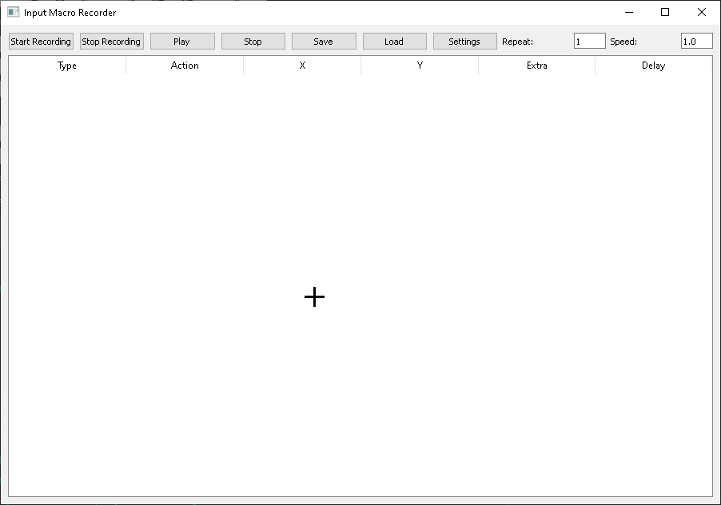
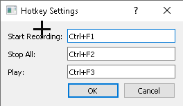

⚔️ **InputDestroyer** is a powerful desktop automation tool for recording and replaying keyboard & mouse actions with GUI-based macro editing. Designed for power users, QA testers, and automation wizards.

---

## 💡 Features

- 🎥 Record all keyboard and mouse actions
- 🎬 Playback macros with accurate timing
- 🎨 Visual editor with editable action table
- 🎹 Configurable hotkeys (Settings Menu)
- 🖱️ Supports mouse movement, clicks, scrolls
- 🧠 Smart delay detection & playback scaling
- 💾 JSON-based session save/load
- 🧼 Prevents infinite recursion during playback
- 🎨 Color-coded event rows (Coming soon!)
- ✏️ Insert/Delete/Edit events (Coming soon!)

---

## 🖥️ GUI Preview

> 
> 

---

## 🎹 Default Hotkeys

| Action               | Default Hotkey  |
|----------------------|-----------------|
| Start Recording      | Ctrl + F1       |
| Stop Recording/Play  | Ctrl + F2       |
| Play Macro           | Ctrl + F3       |

> 🧠 You can customize these hotkeys from the **Settings** menu!

---

## 💾 Saving & Loading

- ✅ Click **Save** to export your macro to `.json`
- ✅ Click **Load** to import a previously saved session
- The file contains all timing, event type, and coordinate data

---

## ⚙️ How It Works

- Uses `pynput` to capture global input events
- Stores events in memory with timestamps
- GUI built with PyQt5, showing a table of actions
- Playback loop executes each event at proper delay

---

## 📦 Requirements

```bash
pip install PyQt5 pynput
